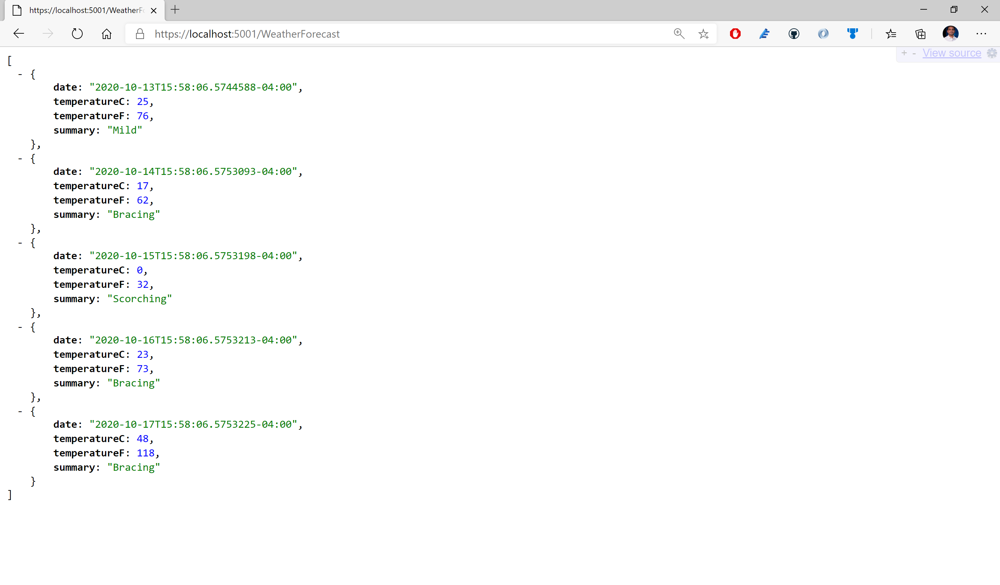

# multiweb
Multiple projects for debugging sample.

## Opening VS Code

Launch VS Code with the project root as the current working directory. One easy way to do this is to type the word "code" followed by a dot "." at a Command Prompt, Powershell window or Windows Terminal.


Powershell/Terminal Command:

```
code .
```


If you already have VS Code open, use the built-in Terminal (Ctrl+`) to change the current directory to the project root.

In either case, you should end up with VS Code open with the Terminal open in the correction location (project root).


## Launch Configuration 

This project contains [launch.json](.vscode/launch.json) configuration for a .NET Core console project and a Web API projet.

Web API Launch Configuration:


Console Project Launch Configuration:


## Debug Panel

In the Debug Panel of VS Code, observe that you can see both configurations, ready for launch.

Web API in Debug Panel:


Console Project in Debug Panel:


## Setting Breakpoints

In the code for each project, set a breakpoint that's easy to identify.

e.g. Inside Get() method within WeatherForecastController.cs in Web API project 


e.g. Console.WriteLine in Console project 


## Debugging with Breakpoints

From the aforementioned Debug Panel, run the Web API project and then the Console project by clicking the Play/Debug button for each launch configuration. 

**Note**: when the web browser launches at the root of the website, you may browse to the WeatherForecast Controller manually, 
e.g. https://localhost:5001/WeatherForecast

You should see each program pause at the breakpoints you set earlier.

e.g. Breakpoint in Web API project:


e.g. Breakpoint in Console project:


## Continue Running

Press the Play/Continue button to continue running while debugging. Observe the output in a web browser (for the Web API project) or the Terminal within VS Code (for the Web API project)

e.g. Output in Web API project:


e.g. Output in Console project:
